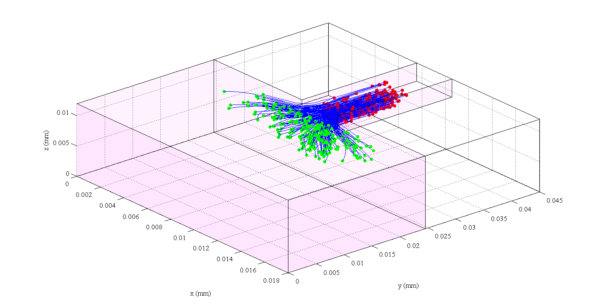

# Orifice trajectories

Orifice entrance experiment by Debashish Saha at ETH Zurich (http://e-collection.library.ethz.ch/view/eth:7048)

### How to cite it? 

Debashish Saha, Miroslav Soos, Beat Lüthi, Markus Holzner, Alex Liberzon, Matthaus U. Babler, and Wolfgang Kinzelbach, "Experimental Characterization of Breakage Rate of Colloidal Aggregates in Axisymmetric Extensional Flow", Langmuir 2014 30 (48), 14385-14395, DOI: 10.1021/la502686b

Don't forget to cite OpenPTV:

OpenPTV consortium, 2013, www.openptv.net


### How to plot this data:

1. Unzip the set (1-5)
2. Using Matlab:

change the location of the directory on line 19 of ```myTraj_Alex ```:

    name=['./set1/trajPoint.',num2Str(i)];

change the first and last file: 

    first=	1;
    last = 5000;

and run the file: 

    >> myTraj_Alex
    
    
You should get something of this kind (probably rotated to a top view, use Matlab figure toolbar to rotate the view):




The data is stored in ```trajPoint``` files which are explained here: <https://github.com/3dptv/3d-ptv-post-process/tree/master/doc>


using PostPTV (the example is not yet ready, modify <https://github.com/OpenPTV/postptv/blob/master/examples/hdf5_scene_analysis.ipynb> 


